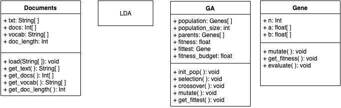

# Evolutionary Topic Modelling For User Issues

## TODO:
- [ ] Scrape issues from a Github open source project page. (e.g. facebook/React)
- [ ] Construct Document Class
- [ ] Construct GA Class
- [ ] Construct Gene Class 

## Class Diagram


## How to run
- Minimum python3 version required is 3.6.2
- pip3 is required
```
sudo apt-get install python3-pip
```
- Install requirements.txt
```
pip3 install -r requirements.txt
```
